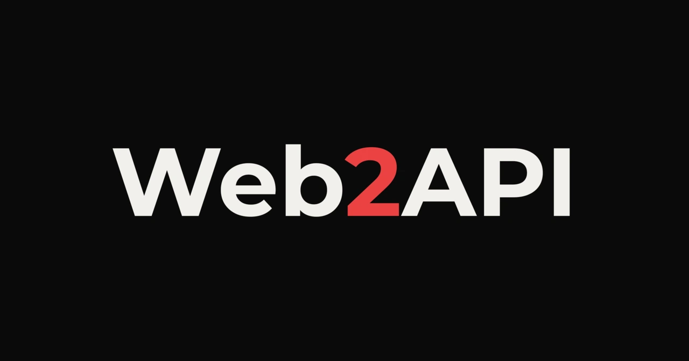

<div align="center">



# Web2API

[](https://www.gnu.org/licenses/gpl-3.0)
[](https://www.npmjs.com/package/web2api-proxy)
[](https://github.com/IMROVOID/Web2API/actions/workflows/test.yml)
[](https://nodejs.org/)
[](https://www.typescriptlang.org/)
[](https://workers.cloudflare.com/)
[](https://platform.openai.com/docs/api-reference)

<p align="center">
  Web-to-OpenAI-compatible API reverse proxy for FreeModels.Pro. Bridge web chat interfaces into a universal OpenAI API gateway with <b>Agent Tool Calling</b>, <b>Prompt Coercion</b>, and <b>Reasoning Traces</b> across <b>Claude Code, Codex, Cursor, Antigravity and more</b>.
</p>

[Overview](#what-is-web2api) • [Features](#key-features) • [Quick Start](#quick-start) • [Models](#model-catalog--aliases) • [Clients](#client-integration) • [Architecture](#architecture--structure) • [Guides](#advanced-guides) • [Disclaimer](#disclaimer--legal-notice) • [License](#license)

</div>

## Table of Contents

- [What is Web2API?](#what-is-web2api)
- [Key Features](#key-features)
- [Quick Start](#quick-start)
  - [Method 1: Local Daemon (NPX / NPM)](#method-1-local-daemon-npx--npm)
  - [Method 2: Cloudflare Workers (Serverless)](#method-2-cloudflare-workers-serverless)
- [Model Catalog & Aliases](#model-catalog--aliases)
  - [Underlying Model Reality (Nemotron-3 Super 120B)](#underlying-model-reality-nemotron-3-super-120b)
- [Client Integration](#client-integration)
- [Architecture & Structure](#architecture--structure)
- [Advanced Guides](#advanced-guides)
  - [Prompt Coercion & Tool Calling](#prompt-coercion--tool-calling)
  - [Resilient JSON Extractor & Sanitizer](#resilient-json-extractor--sanitizer)
  - [429 Quota Exhaustion & Rate Limits](#429-quota-exhaustion--rate-limits)
  - [Environment Variables](#environment-variables)
- [Development & Testing](#development--testing)
  - [Continuous Integration (CI)](#continuous-integration-ci)
- [Disclaimer & Legal Notice](#disclaimer--legal-notice)
- [License](#license)

## What is Web2API?

Web chat platforms (such as [FreeModels.Pro](https://freemodels.pro)) provide free access to high-end frontier models like Claude Sonnet 5, Claude Fable 5, GPT 5.6 Sol, GPT 5.6 Terra, GLM 5.2, and Kimi K3. However, these platforms do not offer developer APIs or standard OAuth client credentials.

Modern coding agents like Claude Code, Codex, Cursor, Antigravity, OpenCode, etc require an OpenAI-compatible API exposing `/v1/chat/completions` with support for structured JSON tool/function calling.

**Web2API** bridges this gap:

1. It acts as an intermediary reverse proxy that intercepts requests from coding agents, translates tool specifications into strict plain-text system directives, and forwards requests to the target web backend (`https://freemodels-chat.freemodels.workers.dev/`).
2. It parses and sanitizes raw model output, stripping markdown code fences (` ```json ... ``` `) and conversational preambles to reliably construct OpenAI `tool_calls` payloads.
3. It supports full Server-Sent Events (SSE) streaming with real-time text delivery, `reasoning_content` (thinking trace) forwarding, and smart tool buffering.
4. It features a dual-runtime architecture: run locally as a zero-dependency **Node.js Daemon** (`http://localhost:8000`) or deploy as a standalone **Cloudflare Worker** (`worker.js`).

> **Disclaimer**: This tool is provided strictly for personal educational and interoperability testing purposes. See [Disclaimer & Legal Notice](#disclaimer--legal-notice).

## Key Features

- **Unlock Free Web Models for Agents**: Access `claude-sonnet-5`, `claude-fable-5`, `sol` (GPT 5.6 Sol), `terra` (GPT 5.6 Terra), `glm-5.2`, and `kimi-k3` directly from coding agents.
- **Dual Operational Modes**:
  - **Local Daemon**: Runs on `http://localhost:8000` via `@hono/node-server` with instant NPX execution or global CLI install.
  - **Cloudflare Worker**: Standalone 82 KB bundle (`worker.js`) ready for copy-paste into the Cloudflare Dashboard or deployment via Wrangler.
- **Smart Tool Coercion**: Converts OpenAI `tools` definitions into strict system instructions, enforcing pure JSON output across web models that lack native function-calling APIs.
- **Resilient JSON Extractor**: Strips markdown fences, extracts outer `{...}` or `[...]` blocks via balanced-brace parsing, and repairs unescaped newlines in diffs.
- **Streaming SSE with Reasoning Delta**: Preserves thinking traces in `delta.reasoning_content` for real-time rendering in assistants like MiMoCode and Cline.
- **Upstream Error Normalization**: Detects 429 key exhaustion responses (`All providers exhausted. Retry in 20s...`) and wraps them in OpenAI-standard error envelopes with `Retry-After` headers.
- **Safe & Resource-Bounded**:
  - Client disconnect cancellation via `AbortSignal`.
  - Browser header emulation (`Origin`, `Referer`, `User-Agent`) to prevent upstream filtering.

## Quick Start

### Method 1: Local Daemon (NPX / NPM)

#### Option A: Run Instantly with NPX (Zero Install)

Run the local proxy daemon immediately with no clone or install needed:

```bash
npx web2api-proxy
```

Or with custom port and API key:

```bash
npx web2api-proxy start --port 8080 --key sk-my-secret
```

Test upstream connectivity and models:

```bash
npx web2api-proxy check
```

#### Option B: Global CLI Installation

Install globally to make the `web2api` command available anywhere on your system:

```bash
npm install -g web2api-proxy
```

Then run:

```bash
web2api start
web2api check
web2api --help
```

#### CLI Options & Flags

| Flag | Shorthand | Environment Variable | Default | Description |
|---|---|---|---|---|
| `--port` | `-p` | `PORT` | `8000` | Port for the local server |
| `--host` | | `HOST` | `127.0.0.1` | Host address to bind to |
| `--key` | `-k` | `API_KEY` | *(None)* | Require Bearer API key authentication |
| `--upstream` | `-u` | `UPSTREAM_URL` | `https://freemodels-chat...` | Target web chat backend URL |
| `--model` | `-m` | `DEFAULT_MODEL` | `claude-sonnet-5` | Default model fallback |
| `--help` | `-h` | | | Show CLI help and options |
| `--version` | `-v` | | | Show installed version |

#### Option C: Clone and Run from Source

```bash
git clone https://github.com/IMROVOID/Web2API.git
cd Web2API
npm install
npm run dev
```

Your local endpoint is available at `http://localhost:8000/v1`. Default API key for all clients is `sk-web2api-local` (or any string when `API_KEY` is not set).


### Method 2: Cloudflare Workers (Serverless)

Deploy a 24/7 serverless gateway without keeping your computer running.

#### Step 1: Build the Worker Bundle (Optional)

```bash
npm run build
```

This compiles the standalone zero-dependency bundle to [`worker.js`](./worker.js) in the project root.

#### Step 2: Create Worker in Cloudflare Dashboard (Primary Method)

1. Log into the [Cloudflare Dashboard](https://dash.cloudflare.com).
2. Go to **Workers & Pages** -> **Create application** -> **Create Worker**.
3. Set the name to `web2api` and click **Deploy**.
4. Click **Edit code**, select all existing code, delete it, and paste the entire copied contents of [`worker.js`](./worker.js).
5. Click **Deploy** in the top right.

#### Step 3: Add Variables & Secrets (Optional)

In your Worker, go to **Settings** -> **Variables and Secrets** and add:

| Variable | Type | Required | Default | Description |
|---|---|---|---|---|
| `API_KEY` | Secret | Optional | *(None)* | Client authorization bearer key (e.g. `sk-web2api-local`). If unset, access is open. |
| `UPSTREAM_URL` | Text | Optional | `https://freemodels-chat.freemodels.workers.dev` | Upstream web chat backend endpoint |
| `DEFAULT_MODEL` | Text | Optional | `claude-sonnet-5` | Default model when unspecified |

Click **Save and deploy**.

Your Cloudflare Worker API URL:

```
https://web2api.<your-subdomain>.workers.dev/v1
```

#### Alternative: Deploy via Wrangler CLI

If you prefer deploying via the command line:

```bash
npx wrangler deploy
```

## Model Catalog & Aliases

Web2API automatically maps requested model aliases to canonical upstream models:

| Request Model Alias | Canonical Upstream Model | Provider | Strengths | Type |
|---|---|---|---|---|
| `claude-sonnet-5`, `claude-3-5-sonnet`, `claude-3-sonnet`, `claude-3-opus` | `claude-sonnet-5` | Anthropic | Thinking, Coding, Analysis | Reasoning |
| `sol`, `gpt-4o-mini`, `claude-3-5-haiku` | `sol` | OpenAI | High Speed, Conversational | Fast |
| `terra`, `gpt-4o`, `gpt-4` | `terra` | OpenAI | Deep Reasoning, Math, Science | Reasoning |
| `claude-fable-5` | `claude-fable-5` | Anthropic | Creative Writing, Long Form | Creative |
| `claude-fable-5.1` | `claude-fable-5.1` | Anthropic | Agentic Coding, Deep Research | Creative |
| `glm-5.2`, `glm-4` | `glm-5.2` | Z.AI | Bilingual, Tools, Knowledge | Pro |
| `kimi-k3`, `kimi` | `kimi-k3` | Moonshot AI | 200K+ Context Window, Recall | Long Context |

### Underlying Model Reality (Nemotron-3 Super 120B)

> [!NOTE]
> **Architecture Reality Check**: While FreeModels.Pro labels its chat options with names like "Claude Sonnet 5", "Claude Fable 5", "GPT 5.6 Sol", "GPT 5.6 Terra", "GLM 5.2", and "Kimi K3", network analysis and response inspection confirm that all requests are actually served by a single open-weights model: **`nvidia/nemotron-3-super-120b-a12b`** (hosted via Nvidia NIM / DashScope provider pools).

#### What Does This Mean?

- **Persona Conditioning**: The upstream Cloudflare Worker injects system personas instructing the Nemotron model to roleplay as the requested target model. This can be observed directly in the `reasoning_content` (thinking trace) chunks where the model references its persona instructions.
- **Still Completely Usable & Capable**: Despite the marketing names, **the service is still completely usable and surprisingly capable**. With ~120 billion parameters, `nemotron-3-super-120b-a12b` is a high-parameter open-weights reasoning model that delivers:
  - Strong code generation, refactoring, and multi-step logic.
  - Native reasoning/thinking traces (`reasoning_content`) for transparent chain-of-thought.
  - High inference throughput and low latency.
- **Web2API Bridging**: Web2API makes this backend fully compatible with coding agents (MiMoCode, Aider, Claude Code, Cline, Cursor) by handling prompt coercion and JSON extraction so tool calling works reliably regardless of the underlying roleplay persona.

**[More Info: Full Reverse Engineering & Model Reality Analysis →](./docs/Underlying_Model_Reality.md)**

## Client Integration

> **Note**: For all clients below, replace `http://localhost:8000/v1` with your Cloudflare Worker URL (`https://web2api.<your-subdomain>.workers.dev/v1`) if using serverless deployment. The default API key is `sk-web2api-local`.

<details>
<summary><b>9Router</b></summary>

Configuration file path:

```text
~/.9router/db.json
```

Or configure via Web Dashboard under **Providers** -> **Add Custom Provider**:

- Provider Type: `openai`
- Base URL: `http://localhost:8000/v1`
- API Key: `sk-web2api-local`
- Models: `claude-sonnet-5, terra, sol, glm-5.2, kimi-k3`

Configuration entry for `~/.9router/db.json`:

```json
{
  "providers": [
    {
      "id": "web2api",
      "name": "Web2API",
      "type": "openai",
      "baseUrl": "http://localhost:8000/v1",
      "apiKey": "sk-web2api-local",
      "models": [
        "claude-sonnet-5",
        "terra",
        "sol",
        "glm-5.2",
        "kimi-k3"
      ]
    }
  ]
}
```

</details>

<details>
<summary><b>Aider</b></summary>

Configuration file path:

```text
.aider.conf.yml
```

Add configuration:

```yaml
openai-api-base: http://localhost:8000/v1
openai-api-key: sk-web2api-local
model: openai/claude-sonnet-5
```

Or run via CLI:

```bash
aider --openai-api-base http://localhost:8000/v1 \
      --openai-api-key sk-web2api-local \
      --model openai/claude-sonnet-5
```

</details>

<details>
<summary><b>Antigravity (AGY)</b></summary>

Configuration file path:

```text
~/.gemini/antigravity/antigravity.json
```

Add configuration:

```json
{
  "modelProviders": {
    "web2api": {
      "type": "openai",
      "baseUrl": "http://localhost:8000/v1",
      "apiKey": "sk-web2api-local",
      "defaultModel": "claude-sonnet-5"
    }
  }
}
```

</details>

<details>
<summary><b>Cherry Studio</b></summary>

Configuration file path:

```text
~/.cherry-studio/config.json
```

Or configure via UI in **Settings** -> **Providers** -> **OpenAI**:

- Custom Server Address: `http://localhost:8000/v1`
- API Key: `sk-web2api-local`
- Models: `claude-sonnet-5`, `terra`, `sol`, `glm-5.2`, `kimi-k3`

</details>

<details>
<summary><b>Claude Code</b></summary>

Configuration file path (Global):

```text
~/.claude/settings.json
```

Configuration file path (Project-level):

```text
.claude/settings.json
```

Add configuration:

```json
{
  "env": {
    "OPENAI_BASE_URL": "http://localhost:8000/v1",
    "OPENAI_API_KEY": "sk-web2api-local",
    "ANTHROPIC_MODEL": "claude-sonnet-5"
  }
}
```

Then run:

```bash
claude
```

</details>

<details>
<summary><b>Cline</b></summary>

Configuration file path:

```text
.vscode/settings.json
```

Add configuration:

```json
{
  "cline.apiProvider": "openai-compatible",
  "cline.openAiBaseUrl": "http://localhost:8000/v1",
  "cline.openAiApiKey": "sk-web2api-local",
  "cline.openAiModelId": "claude-sonnet-5"
}
```

</details>

<details>
<summary><b>Codex</b></summary>

Configuration file path:

```text
~/.codex/config.toml
```

Add configuration:

```toml
[model]
provider = "openai"
base_url = "http://localhost:8000/v1"
api_key = "sk-web2api-local"
model_name = "claude-sonnet-5"
```

</details>

<details>
<summary><b>Continue.dev</b></summary>

Configuration file path:

```text
~/.continue/config.json
```

Add configuration:

```json
{
  "models": [
    {
      "title": "Claude Sonnet 5 (Web2API)",
      "provider": "openai",
      "model": "claude-sonnet-5",
      "apiBase": "http://localhost:8000/v1",
      "apiKey": "sk-web2api-local"
    },
    {
      "title": "GPT 5.6 Terra (Web2API)",
      "provider": "openai",
      "model": "terra",
      "apiBase": "http://localhost:8000/v1",
      "apiKey": "sk-web2api-local"
    }
  ]
}
```

</details>

<details>
<summary><b>Cursor</b></summary>

Configuration file path (Global):

```text
~/.cursor/User/settings.json
```

Configuration file path (Project-level):

```text
.vscode/settings.json
```

Add configuration:

```json
{
  "cursor.openaiBaseUrl": "http://localhost:8000/v1",
  "cursor.openaiApiKey": "sk-web2api-local",
  "cursor.model": "claude-sonnet-5"
}
```

Or configure in **Cursor Settings** -> **Models**:

- Toggle **Override OpenAI Base URL**: `http://localhost:8000/v1`
- Set **OpenAI API Key**: `sk-web2api-local`
- Add model: `claude-sonnet-5`

</details>

<details>
<summary><b>DeepSeek Harness</b></summary>

Configuration file path:

```text
agent.yaml
```

Add configuration:

```yaml
llm:
  api_type: openai
  base_url: "http://localhost:8000/v1"
  api_key: "sk-web2api-local"
  model: "claude-sonnet-5"
  temperature: 0.7
```

</details>

<details>
<summary><b>Hermes</b></summary>

Configuration file path:

```text
~/.hermes/config.json
```

Add configuration:

```json
{
  "llm": {
    "provider": "openai",
    "baseUrl": "http://localhost:8000/v1",
    "apiKey": "sk-web2api-local",
    "model": "claude-sonnet-5"
  }
}
```

</details>

<details>
<summary><b>LibreChat</b></summary>

Configuration file path:

```text
librechat.yaml
```

Add configuration:

```yaml
endpoints:
  custom:
    - name: "Web2API"
      apiKey: "sk-web2api-local"
      baseURL: "http://localhost:8000/v1"
      models:
        default: ["claude-sonnet-5", "terra", "sol", "glm-5.2", "kimi-k3"]
      titleConvo: true
      modelDisplayLabel: "Web2API"
```

</details>

<details>
<summary><b>MiMo Code CLI</b></summary>

Configuration file path (Linux / macOS):

```text
~/.local/share/mimocode/mimocode.jsonc
```

Configuration file path (Windows):

```text
%LOCALAPPDATA%\mimocode\data\mimocode.jsonc
```

Add configuration:

```jsonc
{
  "providers": {
    "web2api": {
      "type": "openai-compatible",
      "baseUrl": "http://localhost:8000/v1",
      "apiKey": "sk-web2api-local",
      "models": [
        "claude-sonnet-5",
        "terra",
        "sol",
        "glm-5.2",
        "kimi-k3"
      ]
    }
  },
  "default_model": "web2api/claude-sonnet-5"
}
```

Or run `mimo`, select **Custom Provider**, and set:

- **Base URL:** `http://localhost:8000/v1`
- **API Key:** `sk-web2api-local`
- **Model:** `claude-sonnet-5`

</details>

<details>
<summary><b>NextChat (ChatGPT-Next-Web)</b></summary>

Configuration file path:

```text
.env.local
```

Add configuration:

```env
BASE_URL=http://localhost:8000
OPENAI_API_KEY=sk-web2api-local
CUSTOM_MODELS=-all,+claude-sonnet-5,+terra,+sol,+glm-5.2,+kimi-k3
```

</details>

<details>
<summary><b>OmniRoute</b></summary>

Configuration file path:

```text
~/.omniroute/providers.json
```

Add configuration via CLI:

```bash
omniroute provider add --id web2api --type openai --base-url http://localhost:8000/v1 --api-key sk-web2api-local --models claude-sonnet-5,terra,sol,glm-5.2,kimi-k3
```

Or add configuration to `~/.omniroute/providers.json`:

```json
{
  "providers": [
    {
      "id": "web2api",
      "name": "Web2API Gateway",
      "type": "openai-compatible",
      "baseUrl": "http://localhost:8000/v1",
      "apiKey": "sk-web2api-local",
      "models": [
        "claude-sonnet-5",
        "terra",
        "sol",
        "glm-5.2",
        "kimi-k3"
      ]
    }
  ]
}
```

</details>

<details>
<summary><b>OpenAI Compatible (Generic / SDKs)</b></summary>

Configuration file path:

```text
.env
```

Add environment configuration:

```env
OPENAI_BASE_URL="http://localhost:8000/v1"
OPENAI_API_KEY="sk-web2api-local"
```

Python SDK example:

```python
from openai import OpenAI

client = OpenAI(
    base_url="http://localhost:8000/v1",
    api_key="sk-web2api-local"
)

response = client.chat.completions.create(
    model="claude-sonnet-5",
    messages=[{"role": "user", "content": "Write quicksort in Python."}],
    stream=True
)

for chunk in response:
    content = chunk.choices[0].delta.content or ""
    print(content, end="", flush=True)
```

Node.js SDK example:

```javascript
import OpenAI from "openai";

const client = new OpenAI({
  baseURL: "http://localhost:8000/v1",
  apiKey: "sk-web2api-local",
});

const response = await client.chat.completions.create({
  model: "claude-sonnet-5",
  messages: [{ role: "user", content: "Write quicksort in TypeScript." }],
});

console.log(response.choices[0].message.content);
```

cURL command:

```bash
curl -X POST http://localhost:8000/v1/chat/completions \
  -H "Content-Type: application/json" \
  -H "Authorization: Bearer sk-web2api-local" \
  -d '{"model":"claude-sonnet-5","messages":[{"role":"user","content":"Hello!"}]}'
```

</details>

<details>
<summary><b>OpenClaw</b></summary>

Configuration file path:

```text
openclaw.json
```

Add configuration:

```json
{
  "providers": {
    "web2api": {
      "type": "openai-compatible",
      "baseURL": "http://localhost:8000/v1",
      "apiKey": "sk-web2api-local",
      "models": [
        "claude-sonnet-5",
        "terra",
        "sol",
        "glm-5.2",
        "kimi-k3"
      ]
    }
  }
}
```

</details>

<details>
<summary><b>OpenCode</b></summary>

Configuration file path (Linux / macOS):

```text
~/.local/share/opencode/opencode.jsonc
```

Configuration file path (Project-level):

```text
opencode.jsonc
```

Add configuration:

```jsonc
{
  "providers": {
    "web2api": {
      "type": "openai-compatible",
      "baseUrl": "http://localhost:8000/v1",
      "apiKey": "sk-web2api-local",
      "models": [
        "claude-sonnet-5",
        "terra",
        "sol",
        "glm-5.2",
        "kimi-k3"
      ]
    }
  },
  "default_model": "web2api/claude-sonnet-5"
}
```

</details>

<details>
<summary><b>OpenHands (OpenDevin)</b></summary>

Configuration file path:

```text
config.toml
```

Add configuration:

```toml
[llm]
model = "openai/claude-sonnet-5"
base_url = "http://localhost:8000/v1"
api_key = "sk-web2api-local"
```

</details>

<details>
<summary><b>Roo Code</b></summary>

Configuration file path:

```text
.vscode/settings.json
```

Add configuration:

```json
{
  "roo-cline.apiProvider": "openai-compatible",
  "roo-cline.openAiBaseUrl": "http://localhost:8000/v1",
  "roo-cline.openAiApiKey": "sk-web2api-local",
  "roo-cline.openAiModelId": "claude-sonnet-5"
}
```

</details>

<details>
<summary><b>Trae (ByteDance Agentic IDE)</b></summary>

Configuration file path:

```text
~/.trae/config.json
```

Add configuration:

```json
{
  "modelProviders": [
    {
      "name": "Web2API",
      "apiType": "openai",
      "endpoint": "http://localhost:8000/v1",
      "apiKey": "sk-web2api-local",
      "models": [
        "claude-sonnet-5",
        "terra",
        "sol",
        "glm-5.2",
        "kimi-k3"
      ]
    }
  ]
}
```

</details>

<details>
<summary><b>Windsurf</b></summary>

Configuration file path:

```text
~/.codeium/windsurf/model_config.json
```

Add configuration:

```json
{
  "customOpenAI": {
    "endpoint": "http://localhost:8000/v1",
    "apiKey": "sk-web2api-local",
    "model": "claude-sonnet-5"
  }
}
```

</details>

## Architecture & Structure

```
Web2API/
├── .github/
│   └── workflows/
│       └── test.yml             # Automated CI test & typecheck workflow
├── src/
│   ├── types.ts                 # OpenAI schemas, upstream contracts, model definitions
│   ├── config.ts                # Model catalog, aliases, browser headers, defaults
│   ├── services/
│   │   ├── prompt-coercer.ts    # Transforms tools into strict JSON system directives
│   │   ├── json-extractor.ts    # Strips markdown fences, parses JSON, formats tool_calls
│   │   ├── upstream-client.ts   # HTTP client with browser headers and error parsing
│   │   └── stream-transformer.ts# Real-time SSE transformer with reasoning_content
│   ├── routes/
│   │   ├── chat.ts              # /v1/chat/completions handler (streaming & tool calls)
│   │   ├── models.ts            # /v1/models catalog handler
│   │   └── health.ts            # /health service status endpoint
│   ├── index.ts                 # Universal Hono application instance (CORS & routes)
│   └── server.ts                # Local Node.js server launcher (@hono/node-server)
├── worker.js                    # Standalone Cloudflare Workers bundle (82 KB)
├── dist/
│   └── server.js                # Standalone Node.js server bundle (102 KB)
├── docs/
│   ├── Underlying_Model_Reality.md        # Nemotron-3 120B reality & trace evidence
│   ├── Freemodels_Reverse_Engineering.md  # Upstream architecture analysis
│   ├── Web2API_MVP_Architecture.md        # Technical architecture spec
│   └── Web2API_Proxy.md                   # Original design guide
├── tests/                       # 18 automated unit and integration tests
├── public/
│   └── Web2API_Banner.webp      # Repository header banner
├── wrangler.toml                # Cloudflare Workers configuration
├── package.json                 # Dependencies and build scripts
└── tsconfig.json                # Strict TypeScript configuration
```

## Advanced Guides

### Prompt Coercion & Tool Calling

Because web frontends lack native `tool_choice` or function calling APIs, Web2API coerces tools into an explicit JSON contract:

1. **Schema Injection**: Injects tool parameters and format rules into the message context:

   ```json
   {
     "name": "tool_name",
     "arguments": { ... }
   }
   ```

2. **Negative Prompting**: Instructs the model to emit only valid JSON without markdown code fences (` ```json `), conversational greetings, or postscripts.
3. **History Normalization**: Serializes previous assistant tool calls and formats tool result messages so the model maintains multi-turn reasoning context.

### Resilient JSON Extractor & Sanitizer

To handle non-compliant model outputs:

1. **Fence Removal**: Regex stripping of ````json ...````.
2. **Balanced-Brace Matching**: Scans for outermost `{...}` or `[...]` structures.
3. **Repair Pipeline**: Fixes unescaped newlines in diffs and strips trailing commas before `}` or `]`.
4. **Validation**: Confirms presence of `name` and `arguments`, constructing standard OpenAI `tool_calls` payloads with unique identifiers (`call_...`).

### 429 Quota Exhaustion & Rate Limits

The upstream backend aggregates API keys from Nvidia NIM and DashScope. When keys run out of quota:

- Upstream returns: `{"error": "All providers exhausted. Retry in 20s..."}`
- Web2API parses the duration, sets the `Retry-After: 20` header, and wraps the error in an OpenAI standard format:

  ```json
  {
    "error": {
      "message": "All providers exhausted. Retry in 20s...",
      "type": "rate_limit_error",
      "code": 429
    }
  }
  ```

### Environment Variables

| Variable | Mode | Default | Description |
|---|---|---|---|
| `PORT` | Local | `8000` | Local HTTP daemon port |
| `API_KEY` | Both | *(None / sk-web2api-local)* | Optional client authorization bearer token. If unset, access is open. |
| `UPSTREAM_URL` | Both | `https://freemodels-chat.freemodels.workers.dev` | Upstream web chat backend endpoint |
| `DEFAULT_MODEL` | Both | `claude-sonnet-5` | Default model when unspecified |

## Development & Testing

Run TypeScript typecheck:

```bash
npm run typecheck
```

Run automated test suite:

```bash
npm test
```

Build standalone bundles:

```bash
npm run build
```

### Continuous Integration (CI)

Web2API includes a GitHub Actions pipeline ([`.github/workflows/test.yml`](./.github/workflows/test.yml)) that automatically runs on every `push` and `pull_request` to `main`:
- Typechecking (`npm run typecheck`)
- Full test suite execution (`npm test`)
- Bundle build verification (`npm run build`)

#### Skipping Tests on Commit

To skip automated tests on documentation or non-functional commits, include any of the following tags in your commit message:
- `[skip test]` or `[skip tests]`
- `[skip ci]` or `[ci skip]`

```bash
git commit -m "docs: update README [skip test]"
```

## Disclaimer & Legal Notice

> **IMPORTANT**: Please read this notice carefully before using or deploying Web2API.

1. **Educational & Research Purposes Only**: This project is developed and distributed exclusively for personal educational, research, and non-commercial API interoperability testing purposes.
2. **Risk of Upstream Changes**: Web chat interfaces and reverse-engineered endpoints may change, become rate-limited, or terminate service at any time without warning.
3. **No Warranty & No Guarantee**: The author and contributors make no claims, promises, or guarantees regarding the safety, status, or longevity of upstream access. This software is provided "AS IS", without warranty of any kind, express or implied.
4. **Assumption of Risk**: You assume full and sole responsibility for any outcomes or damages resulting from using this software. Use strictly at your own risk.
5. **Trademark Attribution**: All product names, logos, and brands (such as "Anthropic", "Claude", "OpenAI", "ChatGPT", "Xiaomi", "MiMoCode") are trademarks or registered trademarks of their respective owners. Web2API is an independent open-source project and is neither affiliated with, maintained by, nor endorsed by any of these entities.

## License

This project is licensed under the **GNU General Public License v3.0 (GPLv3)**. See the [LICENSE](./LICENSE) file for details.
